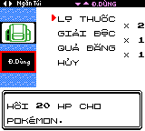
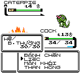

# Pokémon Crystal Vietnamese Translation

A complete Vietnamese localization of Pokémon Crystal.

## How to Play

1. Download the IPS patch (`pokecrystal11vn.ips`) from the [Releases](https://github.com/runlevel5/pokecrystal-vietnam/releases) page
2. Obtain a legal copy of **Pokémon Crystal Version 1.1 (USA/Europe)** ROM
   - Filename: `Pokemon - Crystal Version (UE) (V1.1) [C][!].gbc`
   - SHA1: `f2f52230b536214ef7c9924f483392993e226cfb`
3. Apply the IPS patch using any IPS patching tool:
   - [Lunar IPS](https://www.romhacking.net/utilities/240/) (Windows)
   - [MultiPatch](https://projects.sappharad.com/tools/multipatch.html) (macOS)
   - [UniPatcher](https://play.google.com/store/apps/details?id=org.emunix.unipatcher) (Android)
   - [Rom Patcher JS](https://www.marcrobledo.com/RomPatcher.js/) (Online)
4. Play the patched ROM on any Game Boy Color emulator or flash cart

## About

This project is based on [commit 2ad9616](https://github.com/pret/pokecrystal/commit/2ad9616586212e2a9ed3be812776d133dc47bb8a) of the pokecrystal disassembly project.

While this translation is built upon the English version's codebase, it uses English-based location names with Vietnamese prefixes (e.g., "TP. GOLDENROD" for "GOLDENROD CITY", "NÚI MẶT TRĂNG" for "MT.MOON"). This approach maintains familiarity for players who know the international Pokemon community while providing Vietnamese context.

As of Feb 3rd 2026, the project is considered complete. Please file a bug report if you find any issues.

To aid with your gameplay, please look up the [GLOSSARY](./GLOSSARY.md) for English-Vietnamese translation.

If you are interested in technical decisions made for the project, please look up the [DOC](./AGENTS.md)

## Restored Japanese Designs

This localization restores the original Japanese sprite designs for certain characters and Pokémon. Vietnam does not share the same censorship standards as Western regions, so the content can remain as faithful as possible to the original Japanese version.

**Restored trainer sprites:**
- Beauty, Fisher, Medium, Sage, Swimmer (female)

**Restored Pokémon sprites:**
- Jynx (front, back, and shiny palette)

## Link Cable Trading Compatibility

This Vietnamese version is **fully compatible** with English Pokémon Crystal for link cable trading and battling.

**How it works:**
- When trading with English Crystal, all text data is automatically translated in both directions
- Vietnamese accented characters (á, ă, ê, ô, ơ, ư, đ, etc.) are converted to base letters when sent to English
- English text is properly displayed when received from English Crystal

**Full Vietnamese support:**
- Player/Rival names: Full Vietnamese supported (translated automatically during trading)
- Pokémon nicknames: Full Vietnamese supported (translated automatically during trading)
- Mail messages: Full Vietnamese supported (translated automatically during trading)

**Mail system:**
- Full Vietnamese character input supported for composing mail
- VN → EN: Vietnamese mail is automatically translated to base English letters
- EN → VN: English mail displays correctly using the English font
- VN ↔ VN: Vietnamese mail preserves all accented characters

## Screenshots

## Acknowledgements

* [disassembly project](https://github.com/pret/pokecrystal)

